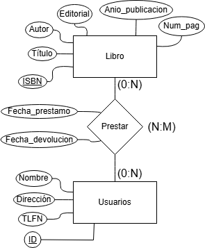
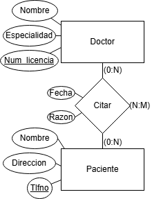

# Ejercicios Diagramas E-R

## Ejercicio 1: Biblioteca

### Descripción:

Diseña una base de datos para una biblioteca que permita gestionar los libros y los préstamos.

### Requisitos:

1. La biblioteca tiene libros. Cada libro tiene un título, autor, editorial, año de publicación y número de páginas.
2. Los usuarios de la biblioteca pueden tomar libros prestados. Cada usuario tiene un nombre, dirección y número de teléfono.
3. Cada préstamo de libro debe registrar la fecha de préstamo, la fecha de devolución y el usuario que tomó prestado el libro.

### Tareas:

1. Identifica las entidades principales y sus atributos.
2. Define las relaciones entre las entidades.
3. Crea un diagrama ERD que represente el diseño de la base de datos.

### Solución presentada:

## Ejercicio 2: Tienda en línea

### Descripción:

Diseña una base de datos para una tienda en línea que gestione productos, clientes y pedidos.

### Requisitos:

1. La tienda tiene productos. Cada producto tiene un nombre, descripción, precio y cantidad en stock.
2. Los clientes pueden registrarse en la tienda. Cada cliente tiene un nombre, dirección de correo electrónico y número de teléfono.
3. Los clientes pueden realizar pedidos. Cada pedido debe registrar la fecha del pedido, los productos comprados, la cantidad de cada producto y el cliente que realizó el pedido.

### Tareas:

1. Identifica las entidades principales y sus atributos.
2. Define las relaciones entre las entidades.
3. Crea un diagrama ERD que represente el diseño de la base de datos.

### Solución presentada:

## Ejercicio 3: Sistema de gestión escolar

### Descripción:

Diseña una base de datos para una escuela que gestione estudiantes, cursos y matriculaciones.

### Requisitos:

1. La escuela ofrece varios cursos. Cada curso tiene un nombre, descripción y número de créditos.
2. Los estudiantes pueden inscribirse en varios cursos. Cada estudiante tiene un nombre, dirección y fecha de nacimiento.
3. Cada inscripción debe registrar el estudiante, el curso y la fecha de inscripción.

### Tareas:

1. Identifica las entidades principales y sus atributos.
2. Define las relaciones entre las entidades.
3. Crea un diagrama ERD que represente el diseño de la base de datos.

### Solución presentada:

## Ejercicio 4: Hospital

### Descripción:

Diseña una base de datos para un hospital que gestione pacientes, doctores y citas médicas.

### Requisitos:

1. El hospital tiene doctores. Cada doctor tiene un nombre, especialidad y número de licencia.
2. Los pacientes pueden programar citas con los doctores. Cada paciente tiene un nombre, dirección y número de teléfono.
3. Cada cita debe registrar la fecha de la cita, el doctor, el paciente y la razón de la visita.

### Tareas:

1. Identifica las entidades principales y sus atributos.
2. Define las relaciones entre las entidades.
3. Crea un diagrama ERD que represente el diseño de la base de datos.

### Solución presentada:

## Ejercicio 5: Red Social

### Descripción:

Diseña una base de datos para una red social que gestione usuarios, publicaciones y comentarios.

### Requisitos:

1. La red social tiene usuarios. Cada usuario tiene un nombre de usuario, correo electrónico y fecha de registro.
2. Los usuarios pueden hacer publicaciones. Cada publicación tiene un contenido, fecha de publicación y el usuario que la realizó.
3. Los usuarios pueden hacer comentarios en las publicaciones. Cada comentario tiene un contenido, fecha del comentario y el usuario que lo realizó.

### Tareas:

1. Identifica las entidades principales y sus atributos.
2. Define las relaciones entre las entidades.
3. Crea un diagrama ERD que represente el diseño de la base de datos.

### Solución presentada:

