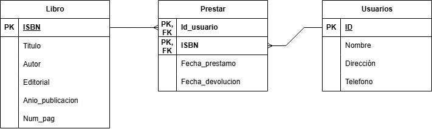
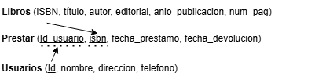
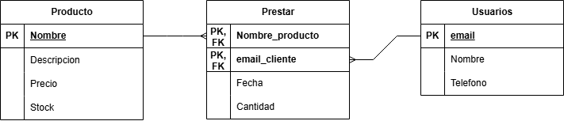
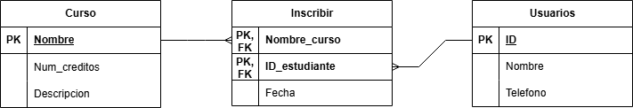
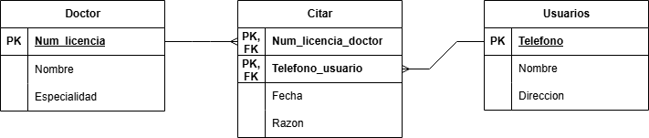
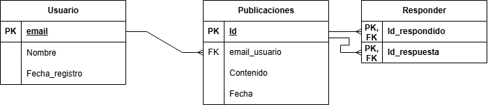

# Ejercicios Sheet 02

## Ejercicio 1

Biblioteca modelo relacional:

Biblioteca modelo tabla:

## Ejercicio 2

Tienda en línea modelo relacional:

Tienda modelo tabla:

## Ejercicio 3

Sistema de gestión escolar modelo relacional:

Sistema de gestión escolar modelo tabla:

## Ejercicio 4

Hospital modelo relacional:

Hospital modelo tabla:

## Ejercicio 5

Red Social modelo relacional:

Red Social modelo tabla:

